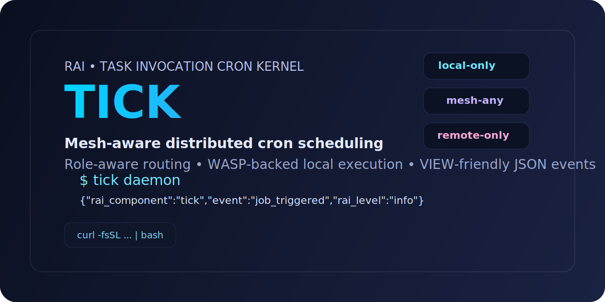
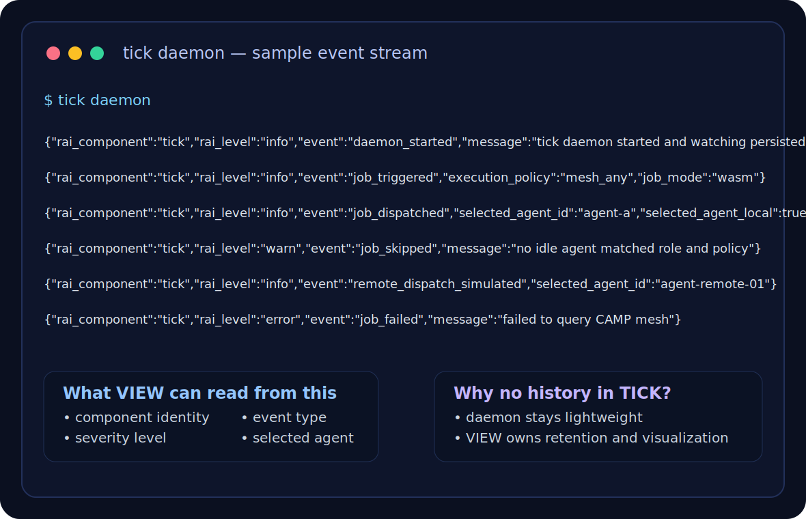

# TICK — Task Invocation Cron Kernel



<p align="left">
  
  
  
  
  
  
</p>

> Mesh-aware distributed cron scheduling for the Rust Agent Infrastructure (RAI).

> **Install in one line**
>
> ```bash
> curl -fsSL https://raw.githubusercontent.com/0xBoji/task_invocation_cron_kernel/main/scripts/install.sh | bash
> ```

TICK is the orchestration pillar of the RAI ecosystem. It exists to answer one simple operational question:

**“When a scheduled task fires, which agent is actually safe to run it right now?”**

Instead of blindly executing cron jobs on a single machine, TICK looks at the local swarm, filters for agents that match the required role, checks which ones are currently `idle`, applies an explicit execution policy, and then dispatches locally or simulates remote routing depending on what the current version supports.

This keeps the scheduler:

- **small** enough to stay understandable,
- **agent-first** enough to fit the rest of the RAI stack,
- **zero-config** enough to run on developer laptops,
- and **future-ready** enough to grow into real mesh offloading once WIRE lands.

---

## Table of Contents

- [Why TICK exists](#why-tick-exists)
- [What TICK does today](#what-tick-does-today)
- [What TICK intentionally does not do](#what-tick-intentionally-does-not-do)
- [Architecture overview](#architecture-overview)
- [Installation](#installation)
  - [Fast path: curl \| bash](#fast-path-curl--bash)
  - [Cargo install from git](#cargo-install-from-git)
  - [Build from source](#build-from-source)
- [Quick start](#quick-start)
- [Banner, badges, and sample output](#banner-badges-and-sample-output)
- [Command reference](#command-reference)
  - [`tick daemon`](#tick-daemon)
  - [`tick add`](#tick-add)
  - [`tick list`](#tick-list)
  - [`tick inspect`](#tick-inspect)
- [Job model](#job-model)
  - [Execution policies](#execution-policies)
  - [Job modes](#job-modes)
- [Persistence model](#persistence-model)
- [JSON event contract](#json-event-contract)
- [Environment variables](#environment-variables)
- [How TICK integrates with CAMP, WASP, and VIEW](#how-tick-integrates-with-camp-wasp-and-view)
- [Design constraints](#design-constraints)
- [Examples](#examples)
- [Development](#development)
- [Verification](#verification)
- [Roadmap](#roadmap)

---

## Why TICK exists

Most cron systems assume one machine, one scheduler, one place where the work happens.

That assumption falls apart in agentic coding systems.

In a swarm, the interesting question is not just **when** a task should run. The interesting questions are:

- Which agent has the right role?
- Which agent is currently free?
- Should this task stay local, or should it be eligible for offload?
- If multiple agents are free, how do we avoid hammering the same one over and over?
- How do we expose scheduling behavior to observability tools without inventing a heavyweight database?

TICK answers those questions with a deliberately explicit model:

- **policy** says *where* execution is allowed,
- **mode** says *how* execution is performed,
- **CAMP** says *who is available*,
- **WASP** says *how local wasm runs safely*,
- and **VIEW** consumes the event stream for history and visualization.

This means TICK can stay thin. It does not need to become a monolith to be useful.

---

## What TICK does today

Current TICK behavior focuses on the useful core:

1. Persist jobs to a lightweight local JSON file.
2. Trigger those jobs using cron expressions.
3. Query the CAMP mesh directly through the Rust crate.
4. Filter for `role` + `status = idle`.
5. Apply an execution policy:
   - `local-only`
   - `mesh-any`
   - `remote-only`
6. Load-balance across multiple candidates using round-robin.
7. If the chosen target is local:
   - run a `wasm` job through `wasp run ...`, or
   - run a `shell` job through `tokio::process::Command`
8. If the chosen target is remote:
   - emit a simulated remote dispatch event for future WIRE integration
9. Emit strict JSON events so VIEW can ingest them directly.

---

## What TICK intentionally does not do

TICK is intentionally conservative.

It does **not** currently:

- persist execution history,
- maintain a SQL database,
- queue secondary retries when everyone is busy,
- invent a central coordinator service,
- perform remote execution over the network,
- or pretend to be a full workflow engine.

That is a feature, not a bug.

History belongs to VIEW.
Transport belongs to WIRE.
Secrets belong to SAFE.
TICK stays focused on scheduling and routing policy.

---

## Architecture overview

At a high level, TICK has five operational layers:

### 1. CLI layer
Parses commands such as:

- `tick daemon`
- `tick add`
- `tick list`
- `tick inspect`

The CLI validates mutually exclusive flags, normalizes mode/policy choices, and converts user input into typed job records.

### 2. Persistence layer
Stores jobs in a single JSON file:

- zero-config
- human-inspectable
- agent-friendly
- easy to back up
- easy to query

### 3. Mesh layer
Uses `coding_agent_mesh_presence` directly rather than shelling out to `camp list --json`.

This gives TICK:

- typed integration,
- cleaner tests,
- lower shell/process overhead,
- and a better long-term seam for richer mesh selection behavior.

### 4. Scheduling + selection layer
The scheduler fires cron triggers, asks the mesh for available agents, filters by role and policy, and round-robins across eligible idle candidates.

### 5. Dispatch layer
The dispatcher decides how local execution happens:

- `wasm` → `wasp run ...`
- `shell` → direct process execution

If the selected target is remote, TICK emits a simulation event instead of trying to fake a transport it does not yet have.

---

## Installation

You have three installation paths depending on how opinionated you want the setup to be.

### Fast path: curl | bash

If you already have **Rust/Cargo** and **Git** installed, the fastest path is:

```bash
curl -fsSL https://raw.githubusercontent.com/0xBoji/task_invocation_cron_kernel/main/scripts/install.sh | bash
```

This installer currently does the simplest useful thing:

- checks that `cargo` exists,
- checks that `git` exists,
- installs `tick` from the GitHub repo,
- forces the latest `main` build into your Cargo bin directory.

If you want to pin a ref, you can pass environment variables into the install pipeline:

```bash
TICK_INSTALL_REF=main \
TICK_INSTALL_REPO=https://github.com/0xBoji/task_invocation_cron_kernel.git \
curl -fsSL https://raw.githubusercontent.com/0xBoji/task_invocation_cron_kernel/main/scripts/install.sh | bash
```

### Cargo install from git

If you prefer to see the exact install command directly:

```bash
cargo install \
  --git https://github.com/0xBoji/task_invocation_cron_kernel.git \
  --branch main \
  --bin tick \
  --locked \
  --force
```

### Build from source

```bash
git clone https://github.com/0xBoji/task_invocation_cron_kernel.git
cd task_invocation_cron_kernel
cargo build --release
```

The compiled binary will be at:

```bash
./target/release/tick
```

---

## Banner, badges, and sample output

### Install banner

The README now leads with a visual banner plus a copy-paste install block so the project reads like a real installable tool instead of a source-only repo.

### Badge strip

The badges intentionally communicate the operational shape of TICK at a glance:

- Rust implementation
- `tick` binary identity
- cron + mesh scheduling focus
- wasm + shell execution support
- JSON-first event output
- lightweight JSON persistence

### Screenshot / log sample

Below is a terminal-style sample asset showing the sort of JSON event stream VIEW is expected to consume.



And here is the same idea as raw log text for easy copy/paste:

```json
{"rai_component":"tick","rai_level":"info","event":"daemon_started","message":"tick daemon started and watching persisted jobs"}
{"rai_component":"tick","rai_level":"info","event":"job_triggered","execution_policy":"mesh_any","job_mode":"wasm"}
{"rai_component":"tick","rai_level":"info","event":"job_dispatched","selected_agent_id":"agent-a","selected_agent_local":true}
{"rai_component":"tick","rai_level":"warn","event":"job_skipped","message":"no idle agent matched role and policy"}
{"rai_component":"tick","rai_level":"info","event":"remote_dispatch_simulated","selected_agent_id":"agent-remote-01"}
{"rai_component":"tick","rai_level":"error","event":"job_failed","message":"failed to query CAMP mesh"}
```

## Quick start

### 1. Add a wasm job

```bash
tick add \
  --cron "*/30 * * * * *" \
  --role coder \
  --policy mesh-any \
  --module ./jobs/reindex.wasm
```

### 2. List jobs

```bash
tick list --json
```

### 3. Inspect one job

```bash
tick inspect <job-id> --json
```

### 4. Run the daemon

```bash
tick daemon
```

If your current repo already has a `.camp.toml`, TICK can derive mesh discovery settings and the local agent id from it.

---

## Command reference

## `tick daemon`

Starts the long-running scheduler process.

```bash
tick daemon
```

Optional tuning:

```bash
tick daemon --sync-interval-ms 2000
```

What it does:

- loads persisted jobs,
- registers cron schedules,
- watches for newly added persisted jobs,
- emits JSON events on every trigger,
- dispatches locally or simulates remote routing.

---

## `tick add`

Adds a job to the persistent job file.

### Wasm mode (default)

```bash
tick add \
  --cron "*/5 * * * * *" \
  --role coder \
  --policy mesh-any \
  --module ./jobs/task.wasm \
  --allow-dir ./workspace \
  --env MODE=fast
```

### Shell mode

```bash
tick add \
  --cron "*/5 * * * * *" \
  --role coder \
  --mode shell \
  --policy local-only \
  --command python3 \
  --arg scripts/task.py
```

### JSON response

```bash
tick add ... --json
```

Returns a single JSON object describing the stored job.

---

## `tick list`

Lists every persisted job from `tick_jobs.json`.

### Human-readable mode

```bash
tick list
```

### JSON mode

```bash
tick list --json
```

JSON mode is the preferred form for tools and agents.

---

## `tick inspect`

Looks up a single job by ID.

```bash
tick inspect 550e8400-e29b-41d4-a716-446655440000
```

### JSON mode

```bash
tick inspect 550e8400-e29b-41d4-a716-446655440000 --json
```

If the job does not exist, JSON mode returns `null`.

---

## Job model

TICK uses two orthogonal concepts:

- **ExecutionPolicy**
- **JobType**

### Execution policies

#### `local-only`
Strict mode. Only the local agent may execute the job.

#### `mesh-any`
Load-balancing mode. Any idle matching agent in the CAMP mesh may be selected, including the local agent.

#### `remote-only`
Strict offload mode. The local agent is excluded. If a remote peer is selected, TICK emits a simulated remote dispatch event.

### Job modes

#### `wasm`
Default mode.

Use this when you want local execution to flow through WASP:

- explicit sandbox boundary,
- explicit allowed directories,
- explicit environment variables,
- safer long-term agent execution story.

#### `shell`
Escape hatch mode.

Use this when the ecosystem still needs to run:

- Python scripts
- Bash wrappers
- local binaries
- transitional glue commands

This is intentionally supported because real agent systems still generate shell-first artifacts today.

---

## Persistence model

TICK persists jobs to a single JSON file.

Default location:

```text
<platform data dir>/tick_jobs.json
```

Examples:

- macOS: `~/Library/Application Support/com.rai.tick/tick_jobs.json`
- Linux: usually somewhere under `~/.local/share`

Override with:

```bash
export TICK_DATA_DIR=/custom/path
```

TICK will then use:

```text
$TICK_DATA_DIR/tick_jobs.json
```

The file is intentionally:

- readable,
- serializable,
- scriptable,
- diffable,
- and easy for other tools to consume.

---

## JSON event contract

Every daemon event emitted by TICK is strict JSON.

Every event includes at least:

```json
{
  "rai_component": "tick",
  "rai_level": "info"
}
```

Depending on the event, additional fields may include:

- `event`
- `timestamp`
- `job_id`
- `cron_expression`
- `agent_role`
- `execution_policy`
- `job_mode`
- `selected_agent_id`
- `selected_agent_local`
- `command_preview`
- `message`

Typical event names:

- `daemon_started`
- `daemon_stopped`
- `job_triggered`
- `job_skipped`
- `job_dispatched`
- `remote_dispatch_simulated`
- `job_failed`

This is the primary contract VIEW is expected to consume.

---

## Environment variables

### `TICK_DATA_DIR`
Overrides the directory where `tick_jobs.json` is stored.

### `TICK_CAMP_CONFIG`
Points TICK at a specific `.camp.toml` if you do not want it to auto-detect one in the current working directory.

### `TICK_CAMP_DISCOVER_MS`
Controls how long the CAMP observer waits before reading discovered agents.

### `TICK_LOCAL_AGENT_ID`
Explicitly sets the local agent id used for policy decisions.
Useful if you need `remote-only` or `local-only` to work outside a repo with `.camp.toml`.

### `TICK_WASP_BIN`
Overrides the binary used for local wasm dispatch.

### `TICK_INSTALL_REPO`
Used by `scripts/install.sh` to override the install Git repository.

### `TICK_INSTALL_REF`
Used by `scripts/install.sh` to override the branch/ref installed by Cargo.

---

## How TICK integrates with CAMP, WASP, and VIEW

### CAMP
CAMP provides discovery and agent availability signals.

TICK cares primarily about:

- agent id,
- role,
- status,
- whether the current agent should be treated as local.

### WASP
WASP is the local secure execution layer.

For `wasm` jobs, TICK delegates local execution into WASP rather than inventing a second sandbox model.

### VIEW
VIEW owns historical observation.

That is why TICK emits JSON events but does **not** persist runtime history.
The daemon stays lighter and the architecture stays cleaner.

---

## Design constraints

TICK follows a few hard rules:

1. **No heavyweight database** for the core scheduler.
2. **No hidden history store** inside the daemon.
3. **No fake remote execution protocol** before WIRE exists.
4. **No ambiguous payload modes** — shell vs wasm must stay explicit.
5. **No policy ambiguity** — local-only, mesh-any, and remote-only must remain semantically distinct.

These constraints keep the tool honest.

---

## Examples

### Add a wasm job and list everything

```bash
tick add \
  --cron "0 */5 * * * *" \
  --role reviewer \
  --policy mesh-any \
  --module ./jobs/review.wasm \
  --allow-dir ./repo \
  --json

tick list --json
```

### Add a shell job that only runs locally

```bash
tick add \
  --cron "*/10 * * * * *" \
  --role maintainer \
  --mode shell \
  --policy local-only \
  --command bash \
  --arg -lc \
  --arg 'echo hello from tick'
```

### Inspect a job

```bash
tick inspect <job-id> --json | jq
```

### Force a custom data directory

```bash
TICK_DATA_DIR=/tmp/tick-dev tick list --json
```

### Use a custom local agent id

```bash
TICK_LOCAL_AGENT_ID=agent-mbp-main tick daemon
```

---

## Development

Clone the repo and run:

```bash
cargo test
cargo fmt --all
cargo clippy --all-targets --all-features -- -D warnings
cargo build
```

TICK is intentionally structured so tests can mock:

- mesh discovery,
- local dispatch,
- query operations,
- and round-robin selection,

without needing to spawn real `wasp` processes or open real CAMP sockets during unit tests.

---

## Verification

Current verification baseline for the repo includes:

```bash
cargo test
cargo fmt --all
cargo clippy --all-targets --all-features -- -D warnings
cargo build
```

Docs/install verification for this README slice should also include:

```bash
bash -n scripts/install.sh
```

---

## Roadmap

Near-term likely directions:

- richer human-readable CLI output
- stronger inspect/list filtering
- real remote execution once WIRE exists
- WASP guest-arg story improvements
- optional README examples for full swarm demos

What TICK should **not** become:

- a hidden database service,
- a second observability system,
- or an overloaded orchestration platform that duplicates the rest of RAI.

---

## Philosophy

TICK is intentionally boring in the right places.

It stores jobs in one file.
It emits JSON.
It asks CAMP who is free.
It lets WASP run local wasm safely.
It leaves history to VIEW.
It leaves transport to WIRE.

That separation is the point.

If the rest of the RAI ecosystem is a flywheel, TICK is the moment where **time-based intention** becomes **routed execution**.
